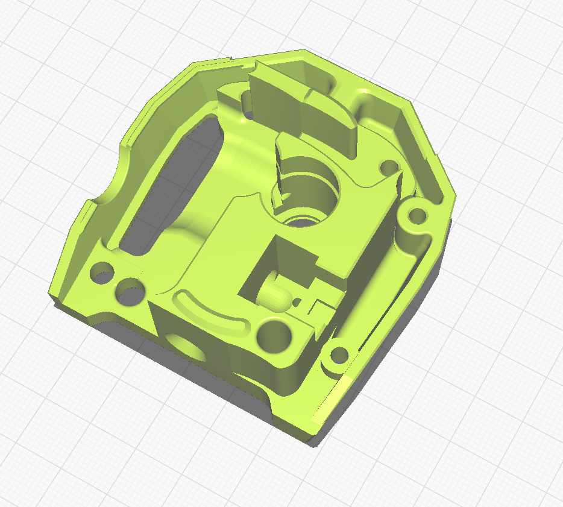

# FRONT PANEL FOR  Galileo extruder for stealthBurner

This is a modified extruder based on Mamsih Galileo-stealthBurner so Big thanks to him !!!!!
# https://github.com/Mamsih/Galileo-stealthBurner

I was inspired by Snympi user - microswitch will bearing ball:
https://www.printables.com/model/177987-voron-stealth-burner-ercf-galileo-filament-sensor-

